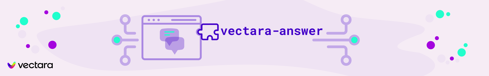

<h1 style="text-align: center">Welcome to vectara-answer</h1>
<p style="text-align: center">
  
</p>
<p>
  
  
  
  <a href="https://github.com/vectara/vectara-answer#readme" target="_blank">
    
  </a>
  <a href="https://github.com/vectara/vectara-answer/graphs/commit-activity" target="_blank">
    
  </a>
  <a href="https://twitter.com/vectara" target="_blank">
    
  </a>
</p>

## About

Vectara Answer is a sample app for [Vectara](https://vectara.com/)-powered Summarized Semantic Search with advanced configuration options. For examples of what you can build with Vectara Answer, check out [Ask News](https://asknews.demo.vectara.com) and [LegalAid](https://legalaid.demo.vectara.com).

**Note:** For more user interface options and a simpler codebase, use [Create-UI](https://github.com/vectara/create-ui).

> [!TIP]
>
> Looking for something else? Try another open-source project:
>
> - **[React-Search](https://github.com/vectara/react-search)**: Add Vectara semantic search to your React apps with a few lines of code.
> - **[Create-UI](https://github.com/vectara/create-ui)**: The fastest way to generate a working React codebase for a range of generative and semantic search UIs.
> - **[Vectara Ingest](https://github.com/vectara/vectara-ingest)**: Sample templates and crawlers for pulling data from many popular data sources.

## Quickstart

### Prerequisites

To get started, the minimum requirement is to install [npm and node](https://nodejs.org/en/download). That's it!

### Running A Sample Application

Vectara Answer comes packaged with preset configurations that allow you to spin up a sample application using Vectara's public datastores. To quickly get started, run the following command:

`npm run bootstrap`

When prompted for which application to create, select from one of three default apps:

1. `Vectara Docs` - Answer questions about Vectara documentation
2. `Vectara.com` - Answer questions about the content of the Vectara company website
3. `AskFeynman` - Answer questions about Richard Feynman's lectures

After selecting which application to create, you'll have the app running in your browser at `http://localhost:4444`.

Congratulations! You've just setup and run a sample app powered by Vectara!

### Under the hood

The `bootstrap` command installs dependencies, runs the configuration script to generate an `.env` file
(which includes all the needed configuration parameters), and spins up the local application.

If you would like to run the setup steps individually, you can run:

- `npm install`: for installing dependencies
- `npm run configure`: for running the configuration script
- `npm run start`: for running the application locally

## Building Your Own Application

### Prerequisites

When building your own application, you will need to:

- **Create a data store:** Log into the [Vectara Console](https://console.vectara.com/) and [create a data store](https://docs.vectara.com/docs/console-ui/creating-a-corpus).
- **Add data to the data store.** You can use [Vectara Ingest](https://github.com/vectara/vectara-ingest/blob/main/README.md#quickstart) to crawl datasets and websites, upload files in the [Vectara Console](https://console.vectara.com/), or use our [Indexing APIs](https://docs.vectara.com/docs/api-reference/indexing-apis/indexing) directly.

### Running Your Custom App

When running `npm run bootstrap`, if you choose `[Create Your Own]` from the application selection prompt, you will be asked to provide:

- Your Vectara customer ID
- The ID of the corpus you created
- The API key of your selected Vectara corpus (**NOTE: Depending on your set up, this may be visible to users. To ensure safe sharing, ensure that this key is set up to only have query access.**)
- Any sample questions to display on the site, to get your users started.

Once provided, the values above will go into your own customized configuration (`.env` file), and your site will be ready to go via `npm start`.

## Make It Your Own!

After the configuration process has created your `.env` file (as part of the bootstrap process), you are free to make modifications to it to suit your development needs. Note that the variables in the `.env` file all have the `REACT_APP` prefix, as is needed to be recognized by Vectara Answer code.

### Vectara Access (required)

```yaml
# These config vars are required for connecting to your Vectara data and issuing requests.
corpus_id: 5
customer_id: 123456789
api_key: "zwt_abcdef..."
```

Note that `corpud_id` can be a set of corpora in which case each query runs against all those corpora.
In such a case, the format is a comma-separated list of corpus IDs, for example:

```yaml
corpus_id: "123,234,345"
```

### Search header (optional)

These configuration parameters enable you to configure the look and feel of the search header.
The search header may include a logo, a title (text) and a description.
Most commonly we just have to define a title and description. If required, the title can be disable
and instead you can use a logo instead, but not that currently the `logo.png` file must be added to the codebase
under the `config_images` folder.

```yaml
# Define the title of your application (renders next to the logo, if exists).
search_title: "My application"

# Define the description to render opposite the logo and title.
search_description: "Data that speaks for itself"

# Define the placeholder text inside the search box.
search_placeholder: "Ask me anything"

# Define the URL the browser will redirect to when the user clicks the logo above the search controls.
search_logo_link: "https://asknews.demo.vectara.com"

# Define the logo that appears in the search header. Any images you place in your `config_images` directory will be available.
search_logo_src: "config_images/logo.png"

# Describe the logo for improved accessibility.
search_logo_alt: "Vectara logo"

# Customize the height at which to render the logo. The width will scale proportionately.
search_logo_height: 20
```

### Summarization parameters (optional)

The way summarization works can be configured as follows:

```yaml
# Switches the mode of the ux to "summary" mode or "search" mode (if not specified defaults to "summary" mode). When set to "summary", a summary is shown along with references used in the summary. When set to "search", only search results are shown and no calls made to the summarization API.
ux: "summary"

# Default language for summary response (if not specified defaults to "auto")
summary_default_language: "eng"

# Number of sentences before and after relevant text segment used for summarization
summary_num_sentences: 3

# Number of results used for summarization
summary_num_results: 10

# The name of the summarization prompt in Vectara
# If you are a Vectara scale customer you can use custom prompts.
# This field names a custom prompt, otherwise it uses the default for the account.
# See https://docs.vectara.com/docs/learn/grounded-generation/select-a-summarizer for available summarization prompts
summary_prompt_name: vectara-summary-ext-v1.2.0

# Whether to enable the Hughes Hallucination Evaluation Model (HEM - https://github.com/vectara/hallucination-leaderboard)
summary_enable_hem: False
```

#### Hybrid Search (optional)

Hybrid search is a capability that combines the strength of neural (semantic) search with traditional keywords search.
By default, Vectara Answer utilizes hybrid search with lambda=0.1 for short queries (num_words<=2) and lambda=0.0 (pure neural search) otherwise, but you can define other values here.

```yaml
# hybrid search
hybrid_search_num_words: 2
hybrid_search_lambda_long: 0.0
hybrid_search_lambda_short: 0.1
```

### Application header and footer (optional)

Vectara Answer can display an application header and footer for branding purposes.
These configuration parameters allow you to configure the look and feel of this header and footer.

```yaml
# Hide or show the app header.
enable_app_header: False

# Hide or show the app footer.
enable_app_footer: False

# Define the title of your app to render in the browser tab.
app_title: "Your application title here"

# Define the URL the browser will redirect to when the user clicks the logo in the app header.
app_header_logo_link: "https://www.vectara.com"

# Define the logo that appears in the app header. Any images you place in your `config_images` directory will be available.
app_header_logo_src: "config_images/logo.png"

# Describe the logo for improved accessibility.
app_header_logo_alt: "Vectara logo"

# Customize the height at which to render the logo. The width will scale proportionately.
app_header_logo_height: 20
```

### Source filters (optional)

If your application uses more than one corpus, you can define source filters to enable the user to narrow their search to a specific corpus.
This feature assumes the following:

- You have defined a `source` meta-data field on the Vectara corpus
- During data ingestion, you've added the source text to each document appropriately (in the `source` metadata field)

The following parameters control how the sources feature works:

```yaml
# Hide or show source filters.
enable_source_filters: True

# whether the "all source" button should be enabled or not (default True)
all_sources: True

# A comma-separated list of the sources on which users can filter.
sources: "BBC,NPR,FOX,CNBC,CNN"
```

The `sources` parameters is a comma-separated list of source names that will be displayed underneath the search bar, and the user can select
if results returned should be from "all source" or one of the selected sources.
In this case you must specify `corpus_id` (see above) to be the list of matching corpus IDs, also comma separated.

For example:

```yaml
enable_source_filters: True
all_sources: True
sources: "BBC,NPR,FOX,CNBC,CNN"
corpus_id: "123,124,125,126,127"
```

If `all_sources` is set to False, the application will only display the individual source but not the "All sources" button.
This means the user will only be able to select a specific source for each query.

### Reranking (optional)

Whether to use Vectara's [reranking](https://docs.vectara.com/docs/api-reference/search-apis/reranking) functionality. Note that reranking currently works for English language only, so if the documents in your corpus are in other languages, it's recommended to set this to "False".

```yaml
# Reranking enabled: True or False
rerank: False

# number of results to use for reranking
rerank_num_results: 50
```

Whether to use Vectara's MMR (Maximum Marginal Relevance) functionality.
Note that if `mmr=true`, it will disable `rerank=true`, as both cannot co-exist

```yaml
# mmr enabled: True or False
mmr: True

# Diversity bias factor (0..1) for MMR reranker. The higher the value, the more MMR is preferred over relevance.
mmr_diversity_bias: 0.3

# number of results to use for reranking
mmr_num_results: 50
```

### Authentication (optional)

`vectara-answer` supports Google SSO front-end authentication.

```yaml
# Configure your app to require the user to log in with Google SSO.
authenticate: True
google_client_id: "cb67dbce87wcc"
```

### Analytics (optional)

```yaml
# Track user interaction with your app using Google Analytics.
google_analytics_tracking_code: "123456789"

# Track user interaction with your app using Google Tag Manager.
gtm_container_id: "GTM-1234567"
```

### Full Story (optional)

```yaml
# Track user experience with Full Story
full_story_org_id: "org1123"
```

## Customizing the code

In addition to customization via configuration, you can customize Vectara Answer further by modifying its code directly in your own fork of the repository.

### Modifying the UI

The UI source code is all in the `src/` directory. See the [UI README.md](https://github.com/vectara/vectara-answer/blob/main/src) to learn how to make changes to the UI source.

### Modifying the Proxy Server

While `npm run start` runs the application with a local client that accesses the Vectara API directly, running the app via Docker (see below) spins up a full-stack solution, using a proxy server to make Vectara API requests.

To modify the request handlers, make changes to `/server/index.js`.

## Docker

By default, Vectara Answer runs locally on your machine using `npm run start`. There is also an option to use Vectara Answer with Docker, which also makes it easy to deploy Vectara Answer to a cloud environment.

Please see these detailed [instructions](DOCKER.md) for more details on using Docker.

## Author

👤 **Vectara**

- Website: https://vectara.com
- Twitter: [@vectara](https://twitter.com/vectara)
- GitHub: [@vectara](https://github.com/vectara)
- LinkedIn: [@vectara](https://www.linkedin.com/company/vectara/)
- Discord: [@vectara](https://discord.gg/GFb8gMz6UH)

## 🤝 Contributing

Contributions, issues and feature requests are welcome!<br/>
Feel free to check [issues page](https://github.com/vectara/vectara-answer/issues). You can also take a look at the [contributing guide](https://github.com/vectara/vectara-answer/blob/master/CONTRIBUTING.md).

## Show your support

Give a ⭐️ if this project helped you!

## 📝 License

Copyright © 2023 [Vectara](https://github.com/vectara).<br />
This project is [Apache 2.0](https://github.com/vectara/vectara-answer/blob/master/LICENSE) licensed.
